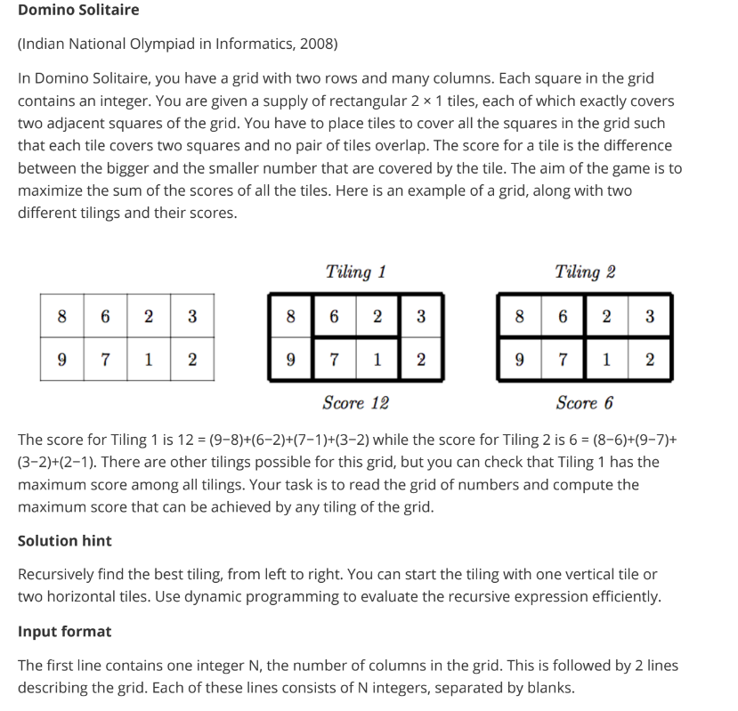

# Linked List Insertion at End
for the given class Linked list ,complete the following method:
`insert_at_end(self,data)` that accept an integer data and append at the 
end of the Linked list. No need to return or print anything inside method

``` python
'''-------------------------GIVEN---------------------------'''

class Node:
    def __init__(self, data):
        # Initialize the node with data and set the next pointer to None
        self.data = data
        self.next = None


class LinkedList:
    def __init__(self):
        # Initialize the linked list with an empty head
        self.head = None
'''---------------------------------------------------------'''

```
---
# Min Difference in Pairs

Implement the function `closest_pair_min_difference(L)` takes list `L` and return smallest absolute 
difference between pairs of elements - the worst case is O(n.log(n)) 

Example:- 
```
L = [5,2,3,4,1] 
```
here several pairs have min difference of 1: 
```
[(1,2),(2,3),(3,4),(4,5)]
```
---
# Treasure Hunter

---
# Domino Solitaire


---
# Binary Search Tree
Consider an implementation of a Binary Search Tree, where each node is created using the given class Node. Suppose it has a root variable that contains the reference to the root node of the binary search tree.

Complete the function `insert_element(root, k)` That accepts the reference of root node root of non-empty binary search tree and an integer k. The function insert the element `k` at the correct position of the binary search tree. The function does not print or return anything.

```python
class Node:
    def __init__(self,data):
    	# Contains reference to the left child node if it exists, otherwise None
        self.left = None 
        # Stores data
        self.data = data
        # Contains reference to the right child node if it exists, otherwise None
        self.right = None
```